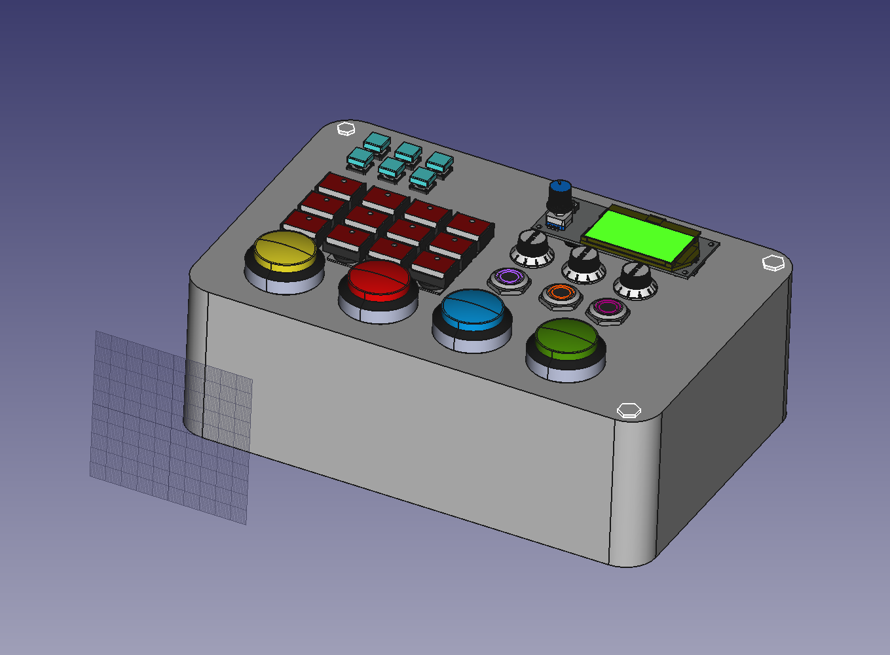
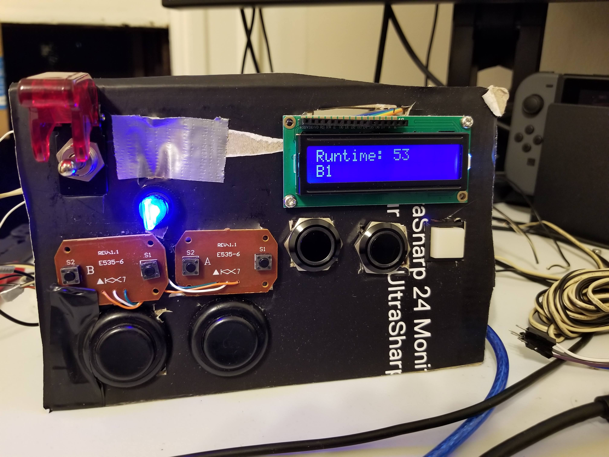

# DeathPanel
The Panel of (the) Deaths! This control panel is designed to allow anyone to interfere with CSH's GDD Imagine 2020 project! It utilizes a Teensy 3.6 and an Arduino Nano to control a lot of neato buttons and dials and switches and knobs and things.

The general idea is that we're going to have several co-op™ minigames for people to walk up to the booth and play. Meanwhile, this control panel will be sitting around and allow other passerbys to view game stats, press buttons, and change something in the game! Nobody really knows what exactly this whole thing will turn into, but I thought it was a neat project that I wanted to do well, and so I made this repo. 

## Images:

